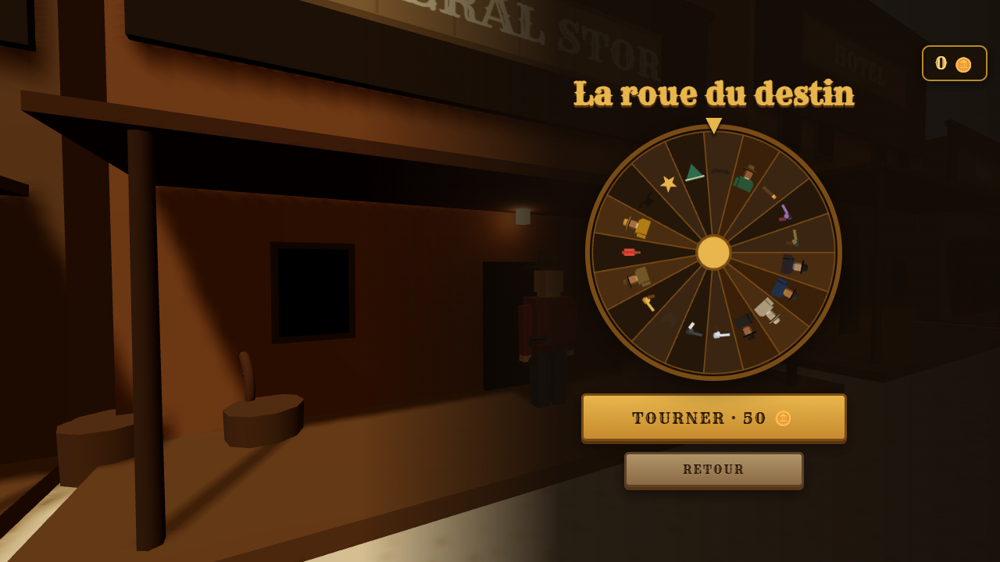
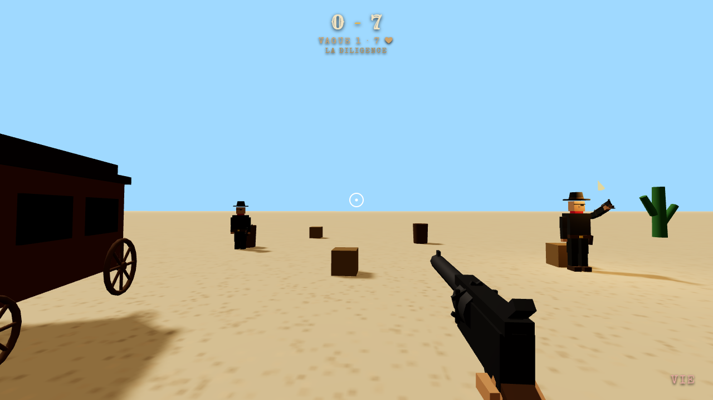

<div align="center">


**High Noon** est un western 1v1 en 3D à la première personne, jouable dans le navigateur - et la ville est le menu : ton pistolero s'y déplace en caméra pour chaque action, sans aucun écran intermédiaire. Attends la cloche, dégaine depuis le holster, remonte ta visée et tire avant l'adversaire - en duel classé, entre amis, dans le mode histoire ou aux mini-jeux.


</div>


## 📷 Screenshots

| La ville (accueil) | Duel |
|:-:|:-:|
|  |  |

| Boutique | Défense de diligence |
|:-:|:-:|
|  |  |


## 🌐 Jouer dans le navigateur

**▶ Jouer maintenant : [emrecan45.github.io/high-noon](https://emrecan45.github.io/high-noon/)**

Aucune installation : le jeu tourne directement dans le navigateur, sur ordinateur comme sur **mobile et tablette** (visée tactile et boutons dédiés). Sur mobile, l'interface reprend **exactement la mise en page PC**, simplement réduite pour tenir à l'écran (pas de réagencement), commandes tactiles conservées.


## 🎮 Gameplay

- **La présentation du duel** : en ligne, un écran **« Adversaire trouvé »** annonce le rival par-dessus le matchmaking ; puis une présentation **face-à-face** montre les deux pistoleros (portrait 3D, pseudo et rang) séparés par un grand **VS**, suivie d'une **intro dans l'arène** où les deux pistoleros s'avancent l'un vers l'autre (vraie animation de marche, caméra qui resserre sur les têtes, pseudo affiché au-dessus). Contre l'IA, la présentation s'enchaîne directement, sans annonce.
- **Le signal** : tirer avant la cloche = tir anticipé, manche perdue.
- **La visée compte** : une balle dans la tête tue net, une balle dans le corps blesse (deux blessures tuent). Un tir manqué impose un rechargement.
- **Le dégainé au skill** : au signal, ton revolver sort du holster en visant bas - c'est à toi de le remonter sur la cible, **sans aucun aléa**. Chaque tir applique un recul à compenser, la respiration du bras suit un rythme lent et régulier qui s'apprend, et en rafales le vent pousse la visée de façon constante à contrer. Impossible de « preshot » : la visée repart du holster à chaque manche.
- **L'esquive** : 2 pas de côté par manche (touches Q/D ou A/E). C'est un vrai pas latéral qui te **déplace pour de bon** - tu restes décalé, tu ne reviens pas à ta position. On peut tirer pendant l'esquive, mais le viseur tremble fort. Si l'adversaire tire pendant ton pas de côté, il rate. S'il attend la fin, tu es à sa merci.
- **Le soleil aveugle** : des éblouissements aléatoires peuvent te blinder avant le signal si tu regardes dans sa direction. Détourne les yeux pour t'en protéger.
- **La brume cache** : par bancs, elle dissimule l'adversaire par intermittence puis se dissipe - pareil pour les deux joueurs en ligne.
- **La kill cam** : le tir décisif passe au ralenti, l'écran vire sépia, le son s'étouffe et la caméra zoome sur le duelliste qui s'effondre.
- **Le plomb laisse des traces** : éclats de bois sur les bâtiments, poussière au sol, douilles éjectées au rechargement.
- **Musique de combat dédiée** : les duels basculent sur une piste tendue (basse pulsée, battement de cœur, nappe menaçante) distincte de la musique des menus.
- **Premier à 3 manches gagnées**, suivi d'une **page de fin de duel** : verdict ligne par ligne, score final, variation de rang et pièces gagnées, plus un récap du match (précision, balles tirées, tirs à la tête).


### 🎲 Manches à modificateurs

Chaque manche tire un modificateur météo qui change les conditions du duel - équiprobable, et jamais deux fois le même d'affilée.

| Modificateur | Effet |
|--|-|
| ☀️ Plein soleil | Conditions parfaites |
| 🌆 Crépuscule | Nuit tombée, silhouettes seulement |
| 🌫️ Brume | Visibilité réduite, bancs de brume qui cachent l'adversaire par intermittence |
| 💨 Rafales | Le vent fait trembler la visée |


### 📏 Distance du duel

Indépendamment du modificateur météo, chaque manche tire aussi silencieusement une distance de duel (aucune annonce à l'écran) :

| Distance | Effet |
|--|-|
| 🔫 Rapprochée (12 m) | Visée facilitée |
| 🤠 Moyenne (19 m) | Distance de référence |
| 🎯 Longue (35 m) | Visée nettement plus difficile |


### 🃏 Perks de remontada

Le perdant d'une manche choisit un avantage parmi trois tirés au hasard, pour le reste du duel.

| Perk | Effet |
|--|-|
| 🔫 Mains rapides | Rechargement 40% plus rapide après un tir manqué |
| 💨 Pas de côté | Une esquive supplémentaire à chaque manche |
| 🦅 Œil d'aigle | La visée pardonne : les tirs proches de la tête comptent |
| 🦺 Gilet renforcé | Un point de vie supplémentaire |
| ❄️ Sang-froid | Le viseur flotte beaucoup moins |
| ⚡ Dégainé souple | Le dégainé désaxe deux fois moins la visée |
| 🕶️ Chapeau baissé | L'éblouissement du soleil ne t'atteint plus |
| 🥾 Éperons | Tu peux ré-esquiver bien plus vite |


### 📖 Mode histoire : la piste de la légende

Six chapitres scénarisés, chacun avec ses conditions imposées et sa réplique d'intro :

| Chapitre | Adversaire | Gimmick |
|--|--|--|
| 1. Le Camp | 🎯 Old Jed | Le tutoriel du dégainé |
| 2. La Gâchette Facile | 🤠 Billy la Gâchette | Il tire le premier… parfois trop tôt |
| 3. Bourrasques | 🌵 El Rápido | Bout portant, dans le vent |
| 4. Duel au crépuscule | 🥃 Doc Silence | De nuit, il punit chaque esquive |
| 5. La brume de Grace | 🕯️ Sœur Grace | Brouillard, une balle une prière |
| 6. Le Croque-Mort | ⚰️ Boss final | Longue distance, gilet et œil d'aigle d'office |

Chaque pistolero arbore une **tenue signature** introuvable en boutique. Les chapitres battus restent rejouables, la progression est sauvegardée (et suit ton compte CrazyGames).

Si un adversaire en ligne quitte ou reste inactif, la manche n'est plus bloquée : **victoire par forfait** accordée automatiquement.

### 🎪 Mini-jeux

Au stand de tir, à la sortie de la ville :

- **Tir aux corbeaux** : 45 secondes, un ciel plein de corbeaux, barillet 6 coups. En solo… ou en **1v1 en ligne** : les deux joueurs tirent sur exactement la même volée (graine partagée) et les scores s'affichent en direct.
- **Défense de diligence** : trois vagues de bandits surgissent derrière les caisses et télégraphient leur tir - abats-les avant qu'ils ne criblent la diligence (8 balles et c'est fini).


## 🕹️ Contrôles

| Action | Touche / geste |
|--|--|
| Viser | Souris (ou glisser sur tactile) |
| Tirer | Clic gauche (ou bouton 🔥 sur tactile) |
| Esquiver à gauche | `Q` ou `A` (ou bouton ◀ sur tactile) |
| Esquiver à droite | `D` ou `E` (ou bouton ▶ sur tactile) |

> Interface en 7 langues (anglais, français, espagnol, allemand, portugais, russe, turc), détectée automatiquement et changeable depuis l'accueil. Musique et effets sonores réglables.


## 🌍 Multijoueur en ligne

Le duel en ligne passe par **Supabase Realtime** : matchmaking par présence (les deux premiers duellistes disponibles s'affrontent), puis échange direct d'événements de duel entre les deux joueurs. Le netcode est insensible à la latence - seuls des événements discrets (tir, esquive, blessure) sont échangés, chacun calé sur une graine de manche partagée ; le joueur touché reste autoritaire sur ses propres esquives et dégâts.

**Duel entre amis** : depuis la barre d'amis, défier un ami en ligne ouvre un salon privé (ou envoie une invitation) - le duel démarre dès que l'ami arrive. Sur CrazyGames, l'invitation passe aussi par le bouton officiel de la plateforme (InstantMultiplayer pour les groupes). Les duels amicaux ne rapportent rien : ni rang, ni pièces - purement pour l'honneur. En 1v1, chaque manche n'est lancée que quand les deux joueurs sont prêts.

Le signal du duel est **imposé par l'hôte** : quand les deux joueurs sont prêts, l'hôte déclenche le « FEU ! » et le diffuse, l'autre client le calque à l'instant près - fini les manches désynchronisées où l'un tire pendant que l'autre attend.

**Le cercle d'amis** : une **barre latérale pleine hauteur à gauche** de l'accueil (façon Fortnite), sous la carte joueur, avec l'ajout d'ami épinglé tout en bas. Sur CrazyGames, elle liste directement tes **amis CrazyGames** (via `user.listFriends()`) avec leur avatar - un bouton DUEL si l'ami joue déjà et est en ligne, sinon INVITER via le système d'invitation CrazyGames. Hors CrazyGames, tu ajoutes des amis par pseudo. Toutes les actions d'amis (demande, acceptation, refus, suppression) se propagent **en temps réel** : la liste de l'autre joueur se met à jour instantanément. Un défi envoie une notification en temps réel sur l'accueil de l'ami : le duel démarre dès qu'il accepte, et un refus (ou une absence de réponse) te sort aussitôt de l'attente avec une alerte.

Deux garde-fous réseau : impossible de **s'affronter soi-même** (deux onglets du même compte ne s'apparient jamais, l'identité de compte étant portée par la présence), et une fois les deux joueurs prêts (premier focus), le déroulé de la partie est **imposé** et continue même si un onglet perd le focus ou passe en arrière-plan.


## 🏆 Mode classé

Chaque joueur reçoit automatiquement un pseudo (« Player1234 », ou son pseudo CrazyGames s'il est connecté là-bas) porté par un compte anonyme Supabase. En **duel classé**, pseudo, tenue et **rang** (Novice, Tireur, Desperado, Légende de l'Ouest, selon les points accumulés) sont visibles par l'adversaire, et le **classement** affiche les 20 meilleurs pistoleros (tête du skin, pseudo, rang, points). Chaque match rapporte des pièces - le classé paie bien plus que l'IA, et les duels amicaux ne rapportent rien du tout.

**Camp d'entraînement** : pendant la recherche d'adversaire, un bouton lance un duel d'échauffement contre **Old Jed**, le mannequin du camp - sans rang ni pièces. Le chrono de recherche reste affiché en jeu et le duel classé démarre tout seul dès qu'un adversaire est trouvé ; quitter l'entraînement ramène sur l'écran de recherche sans perdre sa place dans la file.

Le classement repose sur des **points de duel cumulés** : une victoire en rapporte d'autant plus que l'adversaire est fort, une défaite n'en coûte qu'une poignée et le total ne descend jamais sous le seuil de départ (1000). Les **rangs** sont des paliers de ce total, pour un système lisible qui monte surtout à la victoire (plutôt qu'un Elo qui zigzague). Un garde-fou **anti-matchs arrangés** réduit les gains quand on rejoue le même adversaire dans la journée : points et pièces divisés par deux au deuxième duel, plus aucun point à partir du troisième.

| Résultat | Pièces | Points de duel |
|--|--|--|
| 🏆 Victoire classée | +40 🪙 | +14 à +40 (selon l'adversaire) |
| 💀 Défaite classée | +10 🪙 | -8 (jamais sous 1000) |
| 🤖 Victoire contre l'IA | +8 🪙 | - |
| 🤖 Défaite contre l'IA | +2 🪙 | - |

Le rang, les pièces et les achats sont gérés côté serveur par des fonctions Postgres (RLS + `security definer`), jamais par le client.


## 🤠 Profil, tenues & accessoires

Un clic sur la carte joueur (en haut à gauche de l'accueil) ouvre le profil en une seule colonne, titré par ton **pseudo** (repris de CrazyGames, non modifiable) : les statistiques de carrière (duels, précision, tirs à la tête, série de victoires), puis le pistolero en **3D** (revolver au holster) et le bouton Modifier. Les portraits de l'accueil, des amis et du classement sont **rendus depuis le même modèle 3D** que le personnage en jeu, pour un look cohérent partout. Un bouton **Modifier** ouvre la garde-robe : le pistolero tourne au centre pendant qu'on l'habille avec une **tenue** (8 tenues qui recolorent chapeau, chemise, pantalon, bandana), une **arme** (6 revolvers recolorés, visibles en vue subjective comme sur l'adversaire) et des **accessoires** cumulables par emplacement (moustache, barbe, cigare, cache-œil, étoile de shérif, poncho, plume). Le tout est visible par l'adversaire en ligne. Les pièces gagnées s'affichent en permanence en haut à droite.

## 📅 Défis quotidiens & hebdomadaires

Un **panneau Défis**, à droite de l'accueil, propose 3 objectifs **quotidiens** et 3 **hebdomadaires** - générés de façon déterministe à partir de la date (identiques pour tous les joueurs), avec barre de progression et récompense en pièces à réclamer. La progression est suivie **côté serveur** (table `challenge_progress` + RPC `challenge_state` / `claim_challenge`, protégés par RLS et incrémentés à la fin de chaque duel) et se réinitialise à chaque période. Objectifs types : jouer X duels, en gagner X, gagner X duels classés, placer X tirs à la tête, toucher X fois.

## 🏘️ La ville-menu

Plus d'écrans de menu : l'accueil est **la rue d'une ville western vivante**, ton pistolero au centre et les boutons d'action à gauche. Chaque clic se joue en caméra :

- **Duel classé** : le perso prend la route et attend l'adversaire (camp d'entraînement disponible pendant la recherche).
- **Boutique** : direction le General Store, la roue s'ouvre devant la vitrine.
- **Classement** : le panneau WANTED près du sheriff.
- **Profil / garde-robe** : le miroir devant l'hôtel - l'équipement change en direct sur le personnage.
- **Mini-jeux** : le stand de tir à la sortie de la ville.

La ville respire : PNJ qui déambulent, chevaux à l'attache qui hennissent, corbeaux qui tournoient, linge au vent, fumée de cheminée, rocking-chair, lanternes, tumbleweed. Les barres d'amis (🤝) et de défis (🎯) s'ouvrent en tiroirs par-dessus, le compteur de **joueurs en ligne** et les pièces restent visibles, et le pied de page garde Conditions / Confidentialité.

## 🎡 La roue du destin

La boutique est une roue de la fortune : chaque tour coûte 50 🪙 et fait gagner une tenue, une arme ou un accessoire, tirés côté serveur selon leur rareté (les tenues et armes sont rares, les accessoires plus ou moins courants). Un doublon rembourse 25 🪙. Les pièces se gagnent en duel (le classé paie bien plus que l'IA) et, sur CrazyGames, avec une pub récompensée (+25 🪙) depuis l'accueil.


## 🎪 CrazyGames

Le jeu intègre le **SDK CrazyGames v3** : événements de cycle de jeu (`gameplayStart` / `gameplayStop`), pubs interstitielles entre les matchs, pub récompensée depuis l'accueil, connexion automatique au compte CrazyGames (pseudo repris, session sauvegardée via le module data pour suivre le joueur d'un appareil à l'autre), **liste d'amis CrazyGames** (`user.listFriends()`) dans la barre d'amis, et duels via le bouton d'invitation officiel et InstantMultiplayer. Hors CrazyGames, le SDK se désactive tout seul et le jeu fonctionne normalement.


## 🛠️ Stack technique

- **Three.js** : rendu 3D, modèles low-poly 100% générés (aucun asset externe)
- **Web Audio API** : musiques et bruitages en vrais enregistrements libres (CC0/domaine public) décodés et mixés en Web Audio, petits sons d'interface synthétisés
- **Supabase Realtime** : matchmaking et réseau du duel en ligne
- **Supabase Auth + Postgres** : comptes anonymes, rang, pièces, roue, amis et classement (RLS)
- **SDK CrazyGames** : pubs, liaison de compte et cycle de jeu sur CrazyGames
- **Vite** : build et serveur de développement


## ⚙️ Lancer en local

> Pour les développeurs souhaitant lancer le jeu depuis le code.

```bash
npm install
npm run dev
```

Le duel en ligne, les comptes et le classé demandent un projet [Supabase](https://supabase.com) : renseigner l'URL et la clé publishable dans `src/config.js`, exécuter `db/schema.sql` dans le SQL Editor (idempotent - il active aussi la réplication temps réel de la table `friendships`) et activer les anonymous sign-ins. Sans ça, le jeu reste jouable contre l'IA.


## 📁 Structure du projet

```
high-noon/
├── index.html         # Écrans HTML (menus, HUD, aide)
├── src/
│   ├── main.js        # Point d'entrée, hub, i18n, audio
│   ├── duel.js         # Machine à états du duel (signal, tir, esquive, manches)
│   ├── town.js         # Contrôleur du hub (caméra, déplacements du perso)
│   ├── town3d.js       # Décor de la ville : bâtiments, PNJ, chevaux, ambiance
│   ├── story.js        # Chapitres du mode histoire et progression
│   ├── gallery.js      # Mini-jeux : tir aux corbeaux et défense de diligence
│   ├── ai.js           # Personnalités et comportement de l'IA
│   ├── net.js          # Matchmaking (classé + mini-jeux) et protocole réseau
│   ├── account.js      # Comptes, profil, rang, pièces, amis (Supabase)
│   ├── skins.js        # Catalogue de tenues et portraits 3D générés
│   ├── pages.js        # Notes de version et textes légaux (7 langues)
│   ├── sdk.js          # Intégration du SDK CrazyGames
│   ├── scene.js        # Arène 3D, éclairages, modificateurs de manche
│   ├── revolver.js     # Modèle de revolver single-action partagé
│   ├── cowboy.js        # Personnages articulés et leurs animations
│   ├── viewmodel.js    # Revolver en vue subjective
│   ├── audio.js        # Moteur audio (effets sonores synthétisés)
│   ├── music.js        # Musique d'ambiance synthétisée
│   ├── ui.js           # Écrans, HUD, textes
│   ├── i18n.js         # Traductions (EN, FR, ES, DE, PT, RU, TR)
│   ├── titles.js       # Rangs selon les points
│   ├── accessories.js  # Catalogue d'accessoires et icônes générées
│   ├── weapons.js      # Catalogue d'armes et icônes générées
│   ├── perks.js        # Avantages de remontada
│   ├── modifiers.js    # Modificateurs de manche
│   └── rng.js          # Générateur pseudo-aléatoire à seed partagée
├── docs/               # Logo et captures d'écran du README
├── db/                 # Schéma SQL (profils, skins, accessoires, rang, amis, défis)
├── LICENSE             # Licence du projet (MIT)
└── package.json
```


## 🎨 Crédits

Tout le **visuel est 100% généré** : modèles 3D, textures et portraits sont produits par code (Three.js), aucune image externe. Polices : [Rye](https://fonts.google.com/specimen/Rye) et [Special Elite](https://fonts.google.com/specimen/Special+Elite) via Google Fonts.

L'audio utilise des enregistrements sous licences libres :

| Son | Source | Licence |
|--|--|--|
| Musiques d'accueil et du désert | « The Cowboy's Theme » / « Desert Theme » par Umplix ([OpenGameArt](https://opengameart.org/content/wild-west-music)) | CC0 |
| Musique de combat | « Western ShowDown » par [HoliznaCC0](https://holiznacc0.bandcamp.com/album/left-overs) | CC0 |
| Coup de feu | « Black Powder » par kurt ([OpenGameArt](https://opengameart.org/content/gunshots)) | CC0 |
| Bruitages (portes, cloches, clics, chutes) | « 100 CC0 SFX » par rubberduck ([OpenGameArt](https://opengameart.org/content/100-cc0-sfx)) | CC0 |
| Impacts et pas | « Impact Sounds » par [Kenney](https://kenney.nl/assets/impact-sounds) | CC0 |
| Piano de saloon | « Maple Leaf Rag » de Scott Joplin, enregistrement de 1899 ([Wikimedia Commons](https://commons.wikimedia.org/wiki/File:Scott_Joplin_-_Maple_Leaf_Rag_(1899).ogg)) | Domaine public |
| Hennissement | [Wikimedia Commons](https://commons.wikimedia.org/wiki/File:Wiehern.ogg) | Domaine public |

Les sons d'interface (clics, pièces, roue) restent synthétisés en Web Audio.
