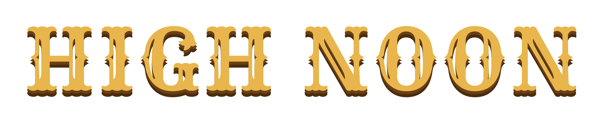

<div align="center">



**High Noon** est un jeu de duel western 1v1 en 3D à la première personne, développé en **JavaScript** avec **Three.js**.

Incarnez un pistolero et affrontez d'autres joueurs en ligne ou l'IA dans des duels rapides exigeant réflexes et précision.  
La clé du succès : dégainer, viser et tirer plus vite que votre adversaire.


</div>

## 📷 Screenshots

| La ville (accueil) | Duel |
|:-:|:-:|
|  |  |

## 🎮 Gameplay

Le joueur participe à des duels au premier arrivé à 3 manches gagnantes.
- **Tir manuel en deux temps :** Le premier clic dégaine, les suivants tirent. La visée est manuelle avec gestion du recul.
- **Esquives :** Jusqu'à 2 pas de côté autorisés par manche pour éviter les balles.
- **Dégâts :** Un tir à la tête est mortel. Deux tirs au corps sont nécessaires pour éliminer l'adversaire.
- **Kill Cam :** Le tir victorieux est diffusé au ralenti.

### 🎲 Modificateurs Météo
Une condition aléatoire est appliquée à chaque manche :

| Modificateur | Effet |
|--|-|
| ☀️ Plein soleil | Conditions parfaites. Risque d'éblouissement. |
| 🌆 Crépuscule | Nuit tombée, seules les silhouettes sont visibles. |
| 🌫️ Brume | Visibilité réduite, bancs de brume intermittents. |
| 💨 Rafales | Le vent dévie la visée. |

### 📏 Distances de tir
Indépendamment de la météo, la distance entre les joueurs varie aléatoirement :

| Distance | Effet |
|--|-|
| 🔫 Rapprochée (12m) | Visée facilitée. |
| 🤠 Moyenne (19m) | Distance de référence. |
| 🎯 Longue (35m) | Visée extrêmement difficile. |

### 🃏 Perks de remontada
Le perdant d'une manche choisit un avantage temporaire parmi 3 tirés au sort :

| Perk | Effet |
|--|-|
| 🔫 Mains rapides | Rechargement 40% plus rapide. |
| 💨 Pas de côté | Une esquive supplémentaire par manche. |
| 🦅 Œil d'aigle | Hitbox des tirs à la tête élargie. |
| 🦺 Gilet renforcé | +1 Point de vie. |
| ❄️ Sang-froid | Réduction du flottement du viseur. |
| ⚡ Dégainé souple | Réduction du tressaillement au dégainé. |
| 🕶️ Chapeau baissé | Immunité contre l'éblouissement. |
| 🥾 Éperons | Réduction du délai entre deux esquives. |

## 🌍 Modes de jeu et Multijoueur

Le jeu fonctionne sur une infrastructure temps réel (**Supabase Realtime**) garantissant l'équité des duels.

- **Duel Classé :** Matchmaking en ligne.
- **Mode Histoire :** 6 chapitres scénarisés contre la bande du Croque-Mort. Cinématiques, dialogues, duels et mini-jeux narratifs (défense de la ville, braquage de banque).
- **Camp d'entraînement :** Duels d'échauffement contre 3 IA pendant la recherche d'adversaire.
- **Amis :** Invitation directe par ID de joueur pour des duels privés.
- **Mini-jeux :** Tir aux corbeaux (45s de survie) et Défense de diligence.

## 🏆 Classement et Saisons

- **Prime en dollars :** Remplace les points classiques. Vous démarrez avec 100$.
- **Gains / Pertes :** Une victoire en classé vole 15% de la prime du perdant. Une défaite retire 10% de sa propre prime.
- **Saisons :** Les saisons durent 30 jours et sont gérées automatiquement. La prime est réinitialisée à 100$ à chaque début de saison.
- **Pass Frontière :** 30 niveaux de récompenses débloqués via l'XP des parties et des défis journaliers/hebdomadaires.

## 🤠 Profil et Boutique

- **Garde-robe :** Personnalisation complète (Chapeaux, chemises, armes, accessoires).
- **Affiche de prime :** Personnalise ton avis de recherche (papier, tampon, encre, pose, titre).
- **Boutique :** Caisse du destin permettant de débloquer de l'équipement avec un système de rareté (Commun à Légendaire).

## 🌐 Jouer dans le navigateur

**▶ Jouer maintenant : [emrecan45.github.io/high-noon](https://emrecan45.github.io/high-noon/)**

Jouable sans installation sur PC, mobile et tablette (commandes tactiles intégrées).

## ⚙️ Installation depuis les sources

**Prérequis :** Node.js et npm.

```bash
git clone https://github.com/Emrecan45/high-noon.git
cd high-noon
npm install
npm run dev
```

> **Base de données :** L'activation du multijoueur requiert la configuration d'un projet Supabase (`db/schema.sql` et `src/config.js`).

## 🕹️ Contrôles

| Action | Touche (PC) | Tactile (Mobile) |
|--|--|--|
| Viser | Souris | Glissement |
| Tirer | Clic Gauche | Bouton 🔥 |
| Esquiver à gauche | `Q` ou `A` | Bouton ◀ |
| Esquiver à droite | `D` ou `E` | Bouton ▶ |

## 📁 Structure du projet

```text
high-noon/
├── index.html            # Point d'entrée
├── package.json          # Dépendances (Three.js, Vite)
├── db/
│   └── schema.sql        # Schéma de base de données (Supabase)
└── src/                  # Code source (JavaScript Vanilla ES6)
    ├── main.js           # Initialisation et boucle de rendu
    ├── scene.js          # Rendu 3D (Three.js), lumières, caméra
    ├── town.js           # Logique de la ville-menu (navigation)
    ├── duel.js           # Mécanique de combat (visée, tir, esquive)
    ├── storymode.js      # Mode histoire (chapitres, cinématiques, dialogues)
    ├── net.js            # Réseau et multijoueur (Supabase Realtime)
    ├── account.js        # Gestion des profils et progression (Prime, XP)
    ├── ai.js             # Comportement des adversaires IA
    ├── ui.js             # Gestion de l'interface et du DOM
    ├── style.css         # Styles (Design System et Responsive)
    └── assets/           # Ressources (audio, logo, icônes)
```

## 🎨 Crédits

La liste détaillée des auteurs pour les ressources audio est disponible dans le fichier [`CREDITS.md`](CREDITS.md).

## 📄 Licence

Ce projet est distribué sous une licence **Tous droits réservés**. Il est strictement interdit de copier, publier ou exploiter commercialement ce code. Voir le fichier [`LICENSE`](LICENSE) pour plus de détails.
