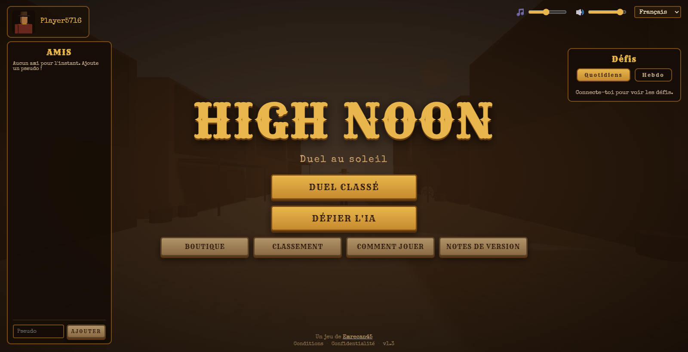
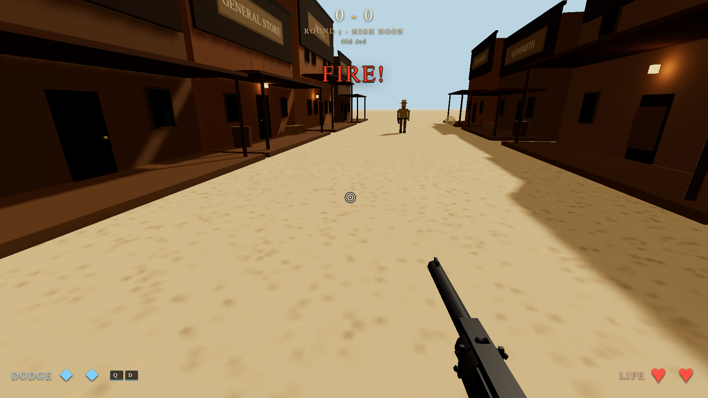

<div align="center">


**High Noon** est un jeu de duel western 1v1 à la première personne, développé en **JavaScript** avec **Three.js**.

Incarnez un pistolero et affrontez d'autres joueurs en ligne ou l'IA dans des duels rapides exigeant réflexes et précision.  
La clé du succès : dégainer, viser et tirer plus vite que votre adversaire.


</div>

## 📷 Screenshots

| La ville (accueil) | Duel |
|:-:|:-:|
|  |  |

## 🎮 Gameplay

Le joueur participe à des duels au premier arrivé à 3 manches gagnantes.
- **Tir manuel en deux temps :** Le premier clic dégaine, les suivants tirent. La visée est manuelle avec gestion du recul.
- **Esquives :** Jusqu'à 2 pas de côté autorisés par manche pour éviter les balles.
- **Dégâts :** Un tir à la tête est mortel. Deux tirs au corps sont nécessaires pour éliminer l'adversaire.
- **Kill Cam :** Le tir victorieux est diffusé au ralenti.

### 🎲 Modificateurs Météo
Une condition aléatoire est appliquée à chaque manche :

| Modificateur | Effet |
|--|-|
| ☀️ Plein soleil | Conditions parfaites. Risque d'éblouissement. |
| 🌆 Crépuscule | Nuit tombée, seules les silhouettes sont visibles. |
| 🌫️ Brume | Visibilité réduite, bancs de brume intermittents. |
| 💨 Rafales | Le vent dévie la visée. |

### 📏 Distances de tir
Indépendamment de la météo, la distance entre les joueurs varie aléatoirement :

| Distance | Effet |
|--|-|
| 🔫 Rapprochée (12m) | Visée facilitée. |
| 🤠 Moyenne (19m) | Distance de référence. |
| 🎯 Longue (35m) | Visée extrêmement difficile. |

### 🃏 Perks de remontada
Le perdant d'une manche choisit un avantage temporaire parmi 3 tirés au sort :

| Perk | Effet |
|--|-|
| 🔫 Mains rapides | Rechargement 40% plus rapide. |
| 💨 Pas de côté | Une esquive supplémentaire par manche. |
| 🦅 Œil d'aigle | Hitbox des tirs à la tête élargie. |
| 🦺 Gilet renforcé | +1 Point de vie. |
| ❄️ Sang-froid | Réduction du flottement du viseur. |
| ⚡ Dégainé souple | Réduction du tressaillement au dégainé. |
| 🕶️ Chapeau baissé | Immunité contre l'éblouissement. |
| 🥾 Éperons | Réduction du délai entre deux esquives. |

## 🌍 Modes de jeu et Multijoueur

Le jeu fonctionne sur une infrastructure temps réel (**Supabase Realtime**) garantissant l'équité des duels.

- **Duel Classé :** Matchmaking en ligne.
- **Mode Histoire :** Une progression scénarisée en chapitres, avec cinématiques, dialogues, duels et mini-jeux narratifs.
- **Camp d'entraînement :** Duels d'échauffement contre 3 IA pendant la recherche d'adversaire.
- **Amis :** Ajout par ID de joueur et invitation directe en duel. Quand le portail expose sa propre liste d'amis, elle est fusionnée à la liste en jeu.
- **Un seul monde :** Les joueurs de tous les portails partagent le même matchmaking, le même classement et la même liste d'amis.
- **Salon privé :** Création d'un salon partageable par lien pour affronter directement un ami, avec proposition d'ajout en ami à la fin du duel.
- **Entraînement :** Tir aux corbeaux (45s de survie), Défense de diligence et Duel amical contre Old Jed.

## 🏆 Classement et Saisons

- **Prime en dollars :** Remplace les points classiques. Vous démarrez avec 100$.
- **Gains / Pertes :** Une victoire en classé vole 15% de la prime du perdant. Une défaite retire 10% de sa propre prime.
- **Saisons :** Les saisons durent 30 jours et sont gérées automatiquement. La prime est réinitialisée à 100$ à chaque début de saison.
- **Pass Frontière :** 30 niveaux de récompenses débloqués via l'XP des parties et des défis journaliers/hebdomadaires.

## 🤠 Profil et Boutique

- **Pseudo :** Repris automatiquement du compte du portail et resynchronisé à chaque partie, donc un changement de nom sur le portail se répercute en jeu. Les pseudos inappropriés sont filtrés en 7 langues, côté client et côté serveur. Deux joueurs peuvent porter le même pseudo : l'identité unique est le code joueur.
- **Garde-robe :** Personnalisation complète (Chapeaux, chemises, armes, accessoires).
- **Affiche de prime :** Personnalise ton avis de recherche (papier, tampon, encre, pose, titre).
- **Boutique :** Caisse du destin permettant de débloquer de l'équipement avec un système de rareté (Commun à Légendaire).

## 🌐 Jouer dans le navigateur

Le jeu est distribué sur les portails de jeux HTML5, jouable sans installation sur PC, mobile et tablette (commandes tactiles intégrées).

## ⚙️ Architecture technique

Ce dépôt est publié pour montrer comment le jeu est construit, pas pour être redéployé : la marche à suivre pour builder et héberger une copie n'y figure pas volontairement. Voir la [licence](LICENSE).

**Client.** JavaScript vanilla ES6 et Three.js, bundlé par Vite. Tout le visuel est généré par le code, sans modèle 3D ni texture importée.

**Couche portail.** Chaque portail de jeux HTML5 a son propre SDK. Le jeu ne les appelle jamais directement : il passe par une façade unique, [`src/sdk.js`](src/sdk.js), servie par un adaptateur choisi au build via le mode Vite. Les adaptateurs vivent dans [`src/platform/`](src/platform) et respectent tous le même contrat, avec [`none.js`](src/platform/none.js) comme implémentation neutre. Un bundle n'embarque donc que le SDK dont il a besoin, et une brique que le portail ne propose pas (publicités, compte joueur, classement, amis) est désactivée proprement en jeu plutôt que cassée.

**Comptes.** Quand le portail propose des comptes, la connexion lie le profil Supabase au compte du joueur : la progression suit d'un appareil à l'autre, les bannissements se propagent, et le pseudo du portail devient celui du jeu. La liaison passe par des edge functions Deno, dans [`tools/supabase/functions/`](tools/supabase/functions), qui échangent le jeton du portail contre une identité Supabase déterministe.

**Temps réel.** Le matchmaking, les salons privés, la présence et les duels s'appuient sur Supabase Realtime, dans [`src/net.js`](src/net.js). Tous les portails partagent le même monde : un seul matchmaking, un seul classement, une seule liste d'amis.

**Base de données.** Le schéma vit dans [`db/`](db) : [`schema.sql`](db/schema.sql) pour les tables, les vues et les fonctions de jeu, [`profanity.sql`](db/profanity.sql) pour le filtre de pseudo côté serveur, [`admin.sql`](db/admin.sql) pour les fonctions de modération, [`delete.sql`](db/delete.sql) pour la remise à zéro. Le numéro de saison est ancré au jour où le schéma est créé, et les saisons de 30 jours s'enchaînent ensuite toutes seules.

**Classement du portail.** Quand le portail expose son propre classement, le jeu y écrit la prime dans la table `prime_s<saison>`, où `<saison>` est la valeur renvoyée par `current_season()`. Si la table de la saison n'existe pas côté portail, l'écriture bascule automatiquement sur la table `prime`.

## 🕹️ Contrôles

| Action | Touche (PC) | Tactile (Mobile) |
|--|--|--|
| Viser | Souris | Glissement |
| Tirer | Clic Gauche | Bouton 🔥 |
| Esquiver à gauche | `Q` ou `A` | Bouton ◀ |
| Esquiver à droite | `D` ou `E` | Bouton ▶ |
| Pause | `P` ou `Échap` | - |

> **Paramètres :** Le bouton ⚙ en haut à droite du menu regroupe la langue, les volumes (musique et effets) et la **sensibilité de visée** (0 à 100 %, 50 % par défaut), qui s'applique à la souris comme au glissement tactile. Ces réglages sont propres à chaque appareil.

## 📁 Structure du projet

```text
high-noon/
├── index.html            # Point d'entrée
├── package.json          # Dépendances (Three.js, Vite)
├── vite.config.js        # Build et choix de l'adaptateur de portail
├── docs/                 # Captures, bannières et vidéo de présentation
├── admin/                # Outil de modération (hors build)
├── tools/                # Outils hors build
│   ├── gen-profanity.mjs # Génération des listes de pseudos interdits
│   ├── wordlists/        # Sources des listes de mots (7 langues)
│   └── supabase/
│       └── functions/    # Edge functions de liaison des comptes de portail
├── db/
│   ├── schema.sql        # Schéma de base de données (Supabase)
│   ├── profanity.sql     # Filtre de pseudo côté serveur (trigger)
│   ├── admin.sql         # Fonctions de l'outil admin
│   └── delete.sql        # Remise à zéro complète de la base
└── src/                  # Code source (JavaScript Vanilla ES6)
    ├── main.js           # Initialisation et boucle de rendu
    ├── scene.js          # Rendu 3D (Three.js), lumières, caméra
    ├── town.js           # Logique de la ville-menu (navigation)
    ├── duel.js           # Mécanique de combat (visée, tir, esquive)
    ├── storymode.js      # Mode histoire (chapitres, cinématiques, dialogues)
    ├── net.js            # Réseau et multijoueur (Supabase Realtime)
    ├── account.js        # Gestion des profils et progression (Prime, XP)
    ├── ai.js             # Comportement des adversaires IA
    ├── ui.js             # Gestion de l'interface et du DOM
    ├── settings.js       # Réglages joueur (sensibilité de visée)
    ├── profanity.js      # Filtre de pseudo multilingue (7 langues)
    ├── sdk.js            # Façade plateforme (pubs, comptes, rooms)
    ├── platform/         # Adaptateurs de portail et contrat de base
    ├── style.css         # Styles (Design System et Responsive)
    └── assets/           # Ressources (audio, logo, icônes)
```

## 🎨 Crédits

La liste détaillée des auteurs pour les ressources audio est disponible dans le fichier [`CREDITS.md`](CREDITS.md).

## 📄 Licence

Ce projet est distribué sous une licence **Tous droits réservés**. Il est strictement interdit de copier, publier ou exploiter commercialement ce code. Voir le fichier [`LICENSE`](LICENSE) pour plus de détails.
